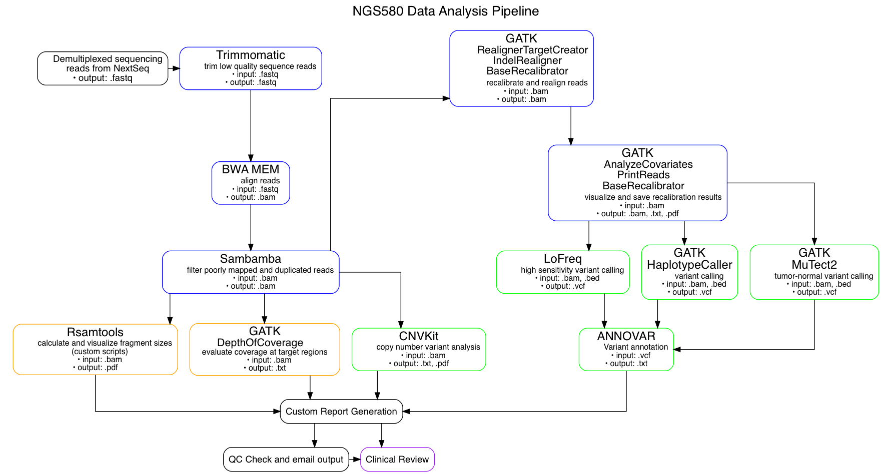

# Description of the Workflow

After DNA sequencing, [automated programs](https://github.com/NYU-Molecular-Pathology/lyz) and scripts submit the sequence reads for demultiplexing, followed by analysis in the targetted exome pipeline. The pipeline is implemented using two programs; the [`sns`](https://github.com/igordot/sns) program which implments a standard exome variant calling pipeline tailored for implementation at NYU's phoenix compute cluster, and the [`snsxt`](https://github.com/NYU-Molecular-Pathology/snsxt) program which included extra analysis and reporting steps customized for usage in the NGS580 gene panel. 

## Pipeline Description

After demultiplexing, sequence reads are first 