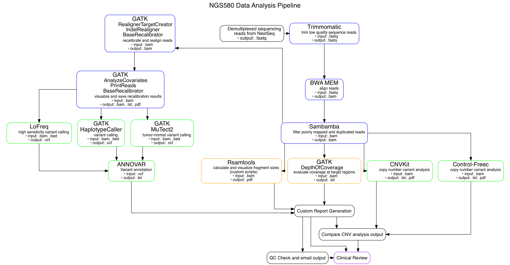

# Description of the Workflow

After DNA sequencing, [automated programs](https://github.com/NYU-Molecular-Pathology/lyz) and [scripts](https://github.com/NYU-Molecular-Pathology/protocols) submit the sequence reads for demultiplexing, followed by analysis in the targetted exome pipeline. The pipeline is implemented using two programs; the [`sns`](https://github.com/igordot/sns) program which implments a standard exome variant calling pipeline tailored for implementation at NYU's phoenix compute cluster, and the [`snsxt`](https://github.com/NYU-Molecular-Pathology/snsxt) program which included extra analysis and reporting steps customized for usage in the NGS580 gene panel. 

## Pipeline Description

After demultiplexing, low quality bases are trimmed by Trimmomatic. Reads are then aligned to the hg19 reference genome using BWA MEM, and passed through Sambamba for quality filtering and deduplication. Reads are then analyzed for quality metrics using the Rsamtools package with custom R scripts, and depth of coverage at target regions with GATK DepthOfCoverage. These reads are then used in copy number variant analysis using a custom pipeline built around CNVkit, and are passed through a standard GATK pipeline for recalibration and realignment before being used in variant calling with GATK HaplotypeCaller (unpaired samples) and MuTect2 (tumor-normal sample pairs), along with LoFreq for high sensitivity variant calling of unpaired samples. 

Variant calls are annotated with ANNOVAR, and all results are aggregated in a custom report generation process which ultimately delivers a summary of analysis results, metrics, and files via email for clinical review. 